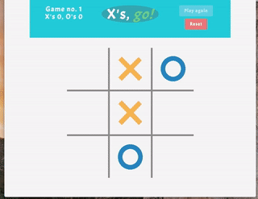
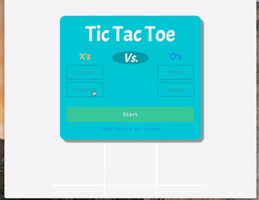

# Tic Tac Toe javascript


### Available to play [here](https://rawgit.com/VitaC123/Tic-Tac-Toe-javascript/master/index.html) via Raw Git.

I began this project as part of the [freeCodeCamp](https://github.com/freeCodeCamp/freeCodeCamp) Front End Development certification. While I was able to satisfy their assigned user stories relatively quickly, I continued developing the project for a few extra weeks, exploring additional features and refining the user experience.

### Basic user stories as assigned by freeCodeCamp:
* I can play a game of Tic Tac Toe with the computer.
* My game will reset as soon as it's over so I can play again.
* I can choose whether I want to play as X or O.

### Additional features:
* Animated X's and O's using ````<canvas>````
* Completely responsive design. Looks great on desktops and mobile devices.  

* Ability to pit the computer against itself.
* A 'start' screen that seamlessly morphs into a scoreboard, and vice versa.  

